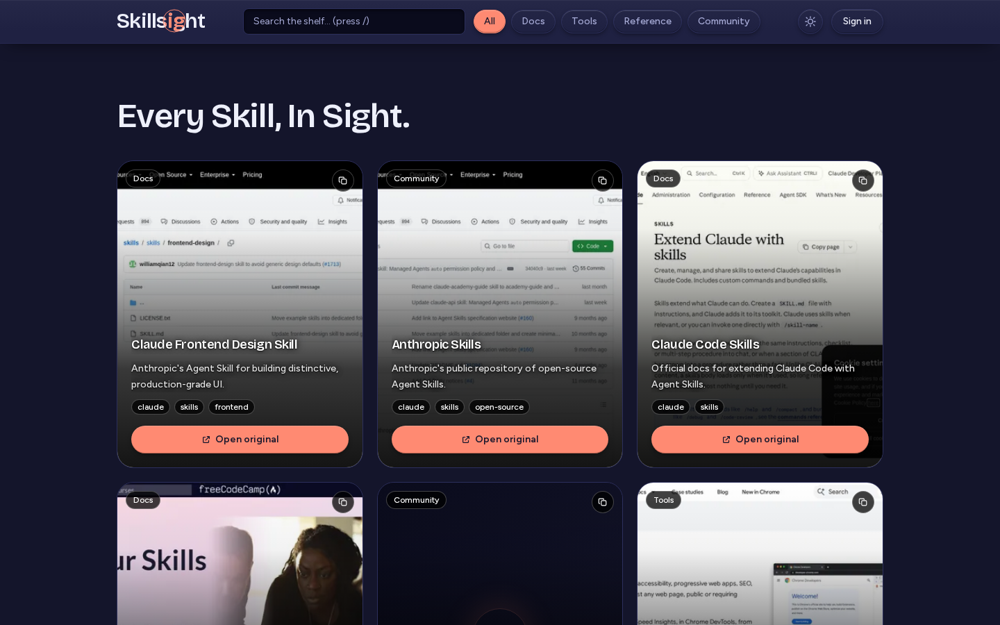
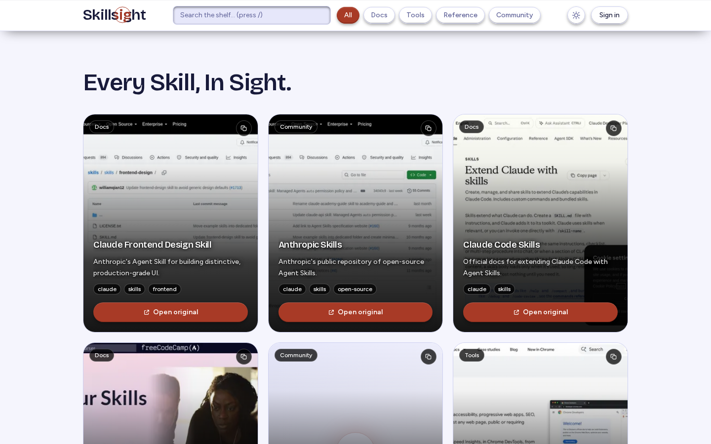
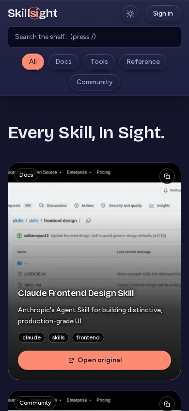

# Skillsight

**Every skill, in sight.** A curated link aggregator for frontend, design, and Claude Code resources — one shelf, in-app preview, and a fast way to actually find the tool you're looking for instead of re-Googling it for the fifth time.

**Live:** [skillsight-mocha.vercel.app](https://skillsight-mocha.vercel.app)



## What problem this solves

Bookmark folders don't scale and browser history is unsearchable noise. If you regularly reach for the same 20-30 design tools, docs sites, and component libraries, you end up either re-searching for them every time or maintaining a messy bookmarks bar nobody else can use. Skillsight replaces that with:

- **One curated shelf** of hand-picked frontend/design/Claude Code resources, organized by category (Docs, Tools, Reference, Community) and tags, with instant fuzzy search (`/` to focus).
- **In-app preview** — click a card and the site opens in an embedded viewer inside Skillsight instead of a context-switching new tab, when the target site allows it. If a site blocks embedding (most do, via `X-Frame-Options`), Skillsight detects that automatically and shows a clean "visit directly" fallback instead of a broken iframe.
- **Auto-generated thumbnails** — every card shows a real screenshot of the destination site, captured server-side, not a generic favicon tile.
- **An admin dashboard** to add, edit, and curate the shelf without touching code or redeploying.

## Feature tour

| | |
|---|---|
| 🔍 **Instant search & filters** | Fuzzy search plus category chips (All / Docs / Tools / Reference / Community) — press `/` anywhere to jump into search. |
| 🖼️ **Real thumbnails** | Each site card is a live-captured screenshot, not a placeholder or favicon blow-up. |
| 🪟 **Smart embedded viewer** | Sites that allow iframing open inline; sites that don't (detected automatically) fall back to a "visit directly" screen — no broken embeds. |
| 🌗 **Dark / light theme** | A single sun–moon morph toggle, persisted per-visitor, no flash-of-wrong-theme on load. |
| 🔐 **Admin dashboard** | Authenticated admin area to add/edit/remove sites, manage users, and review an audit log — no direct DB access needed for day-to-day curation. |
| 📱 **Responsive top to bottom** | Full parity from a 390px phone screen up to desktop, including the toolbar inside the embedded viewer. |

<table>
<tr>
<td></td>
<td></td>
</tr>
<tr>
<td align="center"><em>Light mode</em></td>
<td align="center"><em>Mobile</em></td>
</tr>
</table>

## Tech stack

- **[Next.js 16](https://nextjs.org)** (App Router, Turbopack) — React framework
- **[Tailwind CSS v4](https://tailwindcss.com)** — token-based design system via `@theme`
- **[Framer Motion](https://www.framer.com/motion/)** — animation and page transitions
- **[Drizzle ORM](https://orm.drizzle.team)** + **PostgreSQL** ([Neon](https://neon.tech) in production) — schema and queries
- **[Better Auth](https://www.better-auth.com)** — authentication for the admin dashboard
- **[Vercel Blob](https://vercel.com/storage/blob)** — thumbnail image storage
- **[Playwright](https://playwright.dev)** — server-side screenshot generation for site thumbnails
- Deployed on **[Vercel](https://vercel.com)**

## Getting started locally

```bash
git clone https://github.com/Sour16o4/Skillsight.git
cd Skillsight
npm install
cp .env.example .env   # fill in your local Postgres URL, auth secret, etc.
npm run dev
```

Open [http://localhost:3000](http://localhost:3000).

### Useful scripts

| Command | What it does |
|---|---|
| `npm run dev` | Start the local dev server |
| `npm run build` | Production build |
| `node scripts/seed.mjs` | Seed/update the curated site list (safe to re-run — upserts by slug, never overwrites an existing thumbnail) |
| `node scripts/generate-thumbnails.mjs` | Screenshot every site missing a thumbnail and save it |
| `npm run set-super-admin` | Grant super-admin rights to an existing account |

## Project structure

```
src/
  app/            Routes (App Router) — home, admin, viewer, auth
  components/     UI components (SiteCard, Viewer, AdminDashboard, ...)
  db/             Drizzle schema + client
  lib/            Auth, validation, embed-check, categories, etc.
scripts/          Seeding, thumbnail generation, admin utilities
```

## License

Personal project — no license file yet, all rights reserved by the author.
